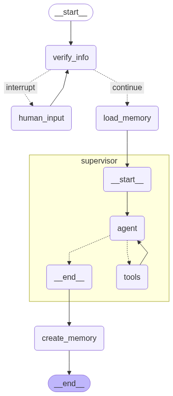
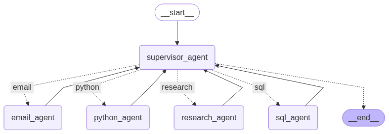

# miniAgent -- 一个简单的基层工作小助手


## 项目核心功能

### multi-agent

- 基于LangGraph构建Supervisor架构的Multi-Agent系统

- Sub-Agent : NL2SQL模块、NL2Python模块、联网查询模块、邮件管理助手

- 构建长短期记忆管理模块，实现对话消息的动态裁剪、总结摘要

- 实现Human-in-the-Loop功能，在AI工作流的关键节点引入人工干预

                  multi-agent的核心架构如图所示
   

   
### sub-agent

- 联网查询功能：接入Google search API, 通过selenium获取网络知识

- GitHub查询功能：接入GitHub API, 让Agent能够查询各种开源项目

- NL2Python 模块：将自然语言描述转化为Python代码

- NL2SQL 模块：将自然语言描述转化为SQL代码，实现本地数据库查询

- 邮件管理助手

                  Supervisor架构的sub-agent如图所示
   


## 项目背景

乡镇一线供电工作不仅要肩负着万家灯火保一方用电的重任，还要应付本单位的、上级单位的、当地从乡镇到省府的各种大大小小的工作。在现场抢修完就马上回办公室写报告和写完报告就立马赶往下一个抢修现场的来回奔波之际，我日思夜想都希望能有一个自动化式的工具能帮我应付这些乱七八糟的报表和报告。如今基于大模型的Agent技术似乎展现出了能替人类分担一些繁琐无意义工作的能力，故该项目尝试利用大模型Agent技术来寻找一个能分担基层工作人员压力的解决方案。


## 项目结构
```
miniAgent
├─ .env
├─ examples.ipynb                # 示例演示
├─ README.md
├─ requirements.txt
└─ src
   ├─ main.py
   ├─ modules                    # 功能模块
   │  ├─ extract_data.py
   │  ├─ fig_inter.py
   │  ├─ get_answer.py
   │  ├─ get_answer_github.py
   │  ├─ miniAgentClass.py
   │  ├─ python_inter.py
   │  └─ sql_inter.py
   └─ utils                       # 调用的工具
      ├─ chat.py
      ├─ common.py
      ├─ database_search.py
      ├─ tools.py
      └─ web_search.py
```

## 项目效果

请看 ```examples.ipynb```

修改```.env```文件，即可通过OpenAI SDK接入在线大模型

直接在终端中运行main.py或者在Jupyter Notebook中运行main.py都可。

## 项目改进

未来准备将Agent助手与 Electrical RAG 项目进行整合，打造一个轻量化的便于一线产业工程师使用的AI大模型智能助手。


